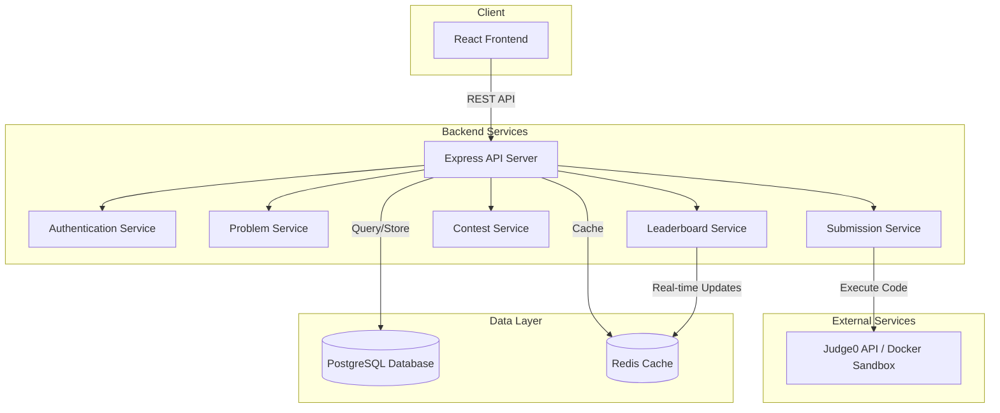
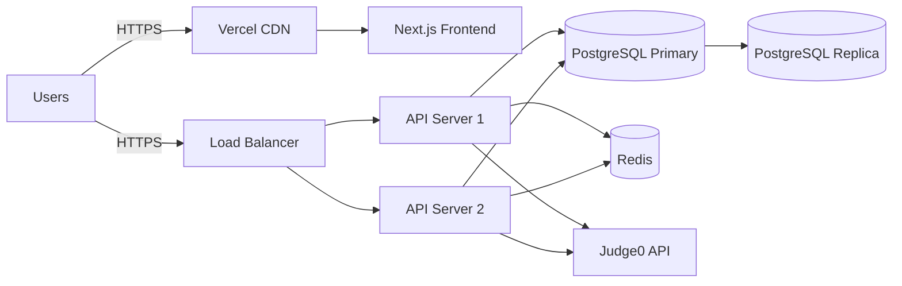

# Design Document

## Overview

The online coding platform is a full-stack web application built with a modern microservices-inspired architecture. The system consists of a React-based frontend, Node.js/Express backend API, PostgreSQL database, and an integrated code execution service using Judge0 API or Docker-based sandbox. The platform supports multi-language code execution, real-time leaderboards, and secure user authentication.

## Architecture

### High-Level Architecture



### Technology Stack

**Frontend:**
- React 18 with TypeScript
- Next.js 14 for SSR and routing
- Tailwind CSS for styling
- Monaco Editor for code editing
- Axios for API calls
- React Query for state management
- Socket.io-client for real-time updates

**Backend:**
- Node.js 20 with Express.js
- TypeScript for type safety
- JWT for authentication
- Bcrypt for password hashing
- Socket.io for WebSocket connections
- Bull for job queue management

**Database:**
- PostgreSQL 15 for relational data
- Redis for caching and real-time leaderboards
- Prisma ORM for database access

**Code Execution:**
- Judge0 API (primary option)
- Docker containers (fallback/self-hosted option)
- Language support: Python, C, C++, Java, JavaScript, C#, Go, PHP

**Deployment:**
- Frontend: Vercel
- Backend: Render or AWS EC2
- Database: PostgreSQL on Render or AWS RDS
- Redis: Redis Cloud or AWS ElastiCache

## Components and Interfaces

### Frontend Components

#### 1. Authentication Module
- **LoginPage**: User login form with JWT token handling
- **RegisterPage**: User registration with validation
- **AuthContext**: Global authentication state management
- **ProtectedRoute**: Route guard for authenticated pages

#### 2. Problem Module
- **ProblemList**: Displays filterable list of problems with difficulty, tags, and acceptance rate
- **ProblemDetail**: Shows problem description, constraints, and examples
- **CodeEditor**: Monaco-based editor with language selection and theme support
- **TestCasePanel**: Displays sample test cases and custom input options
- **SubmissionResult**: Shows verdict, execution time, memory usage, and test case results

#### 3. Contest Module
- **ContestList**: Displays upcoming, active, and past contests
- **ContestDetail**: Shows contest problems, rules, and timer
- **ContestLeaderboard**: Real-time ranking table with auto-refresh
- **ContestRegistration**: Contest enrollment interface

#### 4. User Dashboard Module
- **ProfilePage**: User statistics, solved problems, and achievements
- **SubmissionHistory**: Paginated list of all user submissions with filters
- **StatsChart**: Visual representation of progress and activity

#### 5. Admin Module
- **AdminDashboard**: System overview with metrics
- **ProblemManager**: CRUD interface for problems and test cases
- **ContestManager**: Contest creation and management
- **SubmissionMonitor**: View and rerun submissions

### Backend API Endpoints

#### Authentication API
```
POST   /api/auth/register          - Register new user
POST   /api/auth/login             - Login user
POST   /api/auth/refresh           - Refresh JWT token
GET    /api/auth/me                - Get current user profile
```

#### Problem API
```
GET    /api/problems               - List problems (with filters)
GET    /api/problems/:id           - Get problem details
POST   /api/problems               - Create problem (admin)
PUT    /api/problems/:id           - Update problem (admin)
DELETE /api/problems/:id           - Delete problem (admin)
POST   /api/problems/:id/testcases - Upload test cases (admin)
```

#### Submission API
```
POST   /api/submissions            - Submit code for evaluation
GET    /api/submissions/:id        - Get submission details
GET    /api/submissions/user/:userId - Get user submission history
POST   /api/submissions/:id/run    - Run code with custom input
```

#### Contest API
```
GET    /api/contests               - List contests
GET    /api/contests/:id           - Get contest details
POST   /api/contests               - Create contest (admin)
PUT    /api/contests/:id           - Update contest (admin)
POST   /api/contests/:id/register  - Register for contest
GET    /api/contests/:id/leaderboard - Get contest leaderboard
GET    /api/contests/:id/submissions - Get contest submissions
```

#### User API
```
GET    /api/users/:id              - Get user profile
GET    /api/users/:id/stats        - Get user statistics
GET    /api/users/:id/submissions  - Get user submissions
PUT    /api/users/:id              - Update user profile
```

#### Leaderboard API
```
GET    /api/leaderboard/global     - Get global leaderboard
GET    /api/leaderboard/contest/:id - Get contest leaderboard
```

### Backend Services

#### 1. Authentication Service
- **Responsibilities**: User registration, login, JWT token generation and validation
- **Key Methods**:
  - `register(userData)`: Create new user with hashed password
  - `login(credentials)`: Validate credentials and issue JWT
  - `verifyToken(token)`: Validate JWT and extract user info
  - `refreshToken(refreshToken)`: Issue new access token

#### 2. Problem Service
- **Responsibilities**: Problem CRUD operations, test case management
- **Key Methods**:
  - `createProblem(problemData)`: Create new problem
  - `getProblem(id)`: Retrieve problem with appropriate test cases
  - `updateProblem(id, updates)`: Update problem details
  - `deleteProblem(id)`: Soft delete problem
  - `uploadTestCases(problemId, testCases)`: Store test cases
  - `listProblems(filters)`: Get filtered problem list

#### 3. Submission Service
- **Responsibilities**: Code submission handling, evaluation orchestration
- **Key Methods**:
  - `submitCode(userId, problemId, code, language)`: Create submission and queue for evaluation
  - `evaluateSubmission(submissionId)`: Execute code and compare outputs
  - `getSubmission(id)`: Retrieve submission details
  - `runCode(code, language, input)`: Execute code with custom input
  - `updateVerdict(submissionId, verdict, metrics)`: Store evaluation results

#### 4. Contest Service
- **Responsibilities**: Contest management, participant tracking
- **Key Methods**:
  - `createContest(contestData)`: Create new contest
  - `registerUser(contestId, userId)`: Register user for contest
  - `getActiveContests()`: List active contests
  - `getContestProblems(contestId)`: Get problems for contest
  - `finalizeContest(contestId)`: Calculate final rankings

#### 5. Leaderboard Service
- **Responsibilities**: Ranking calculation, real-time updates
- **Key Methods**:
  - `updateGlobalRank(userId)`: Recalculate user's global rank
  - `updateContestRank(contestId, userId)`: Update contest leaderboard
  - `getGlobalLeaderboard(page, limit)`: Retrieve paginated global rankings
  - `getContestLeaderboard(contestId)`: Get contest rankings
  - `calculatePoints(submission, contest)`: Compute points for submission

#### 6. Judge Service
- **Responsibilities**: Code execution, sandbox management
- **Key Methods**:
  - `executeCode(code, language, input, timeLimit, memoryLimit)`: Run code in sandbox
  - `compareOutput(actual, expected)`: Compare outputs with whitespace handling
  - `getLanguageConfig(language)`: Get compiler/interpreter settings
  - `cleanupExecution(executionId)`: Remove temporary files

## Data Models

### User Model
```typescript
interface User {
  id: string;
  username: string;
  email: string;
  passwordHash: string;
  role: 'user' | 'admin';
  rating: number;
  rank: number;
  problemsSolved: number;
  totalSubmissions: number;
  createdAt: Date;
  updatedAt: Date;
}
```

### Problem Model
```typescript
interface Problem {
  id: string;
  title: string;
  slug: string;
  description: string;
  inputFormat: string;
  outputFormat: string;
  constraints: string;
  difficulty: 'Easy' | 'Medium' | 'Hard';
  topics: string[];
  timeLimit: number; // milliseconds
  memoryLimit: number; // MB
  acceptanceRate: number;
  totalSubmissions: number;
  acceptedSubmissions: number;
  createdBy: string;
  createdAt: Date;
  updatedAt: Date;
}
```

### TestCase Model
```typescript
interface TestCase {
  id: string;
  problemId: string;
  input: string;
  expectedOutput: string;
  isPublic: boolean;
  points: number;
  orderIndex: number;
}
```

### Submission Model
```typescript
interface Submission {
  id: string;
  userId: string;
  problemId: string;
  contestId?: string;
  code: string;
  language: string;
  verdict: 'Accepted' | 'Wrong Answer' | 'Time Limit Exceeded' | 
           'Runtime Error' | 'Compilation Error' | 'Pending';
  executionTime: number; // milliseconds
  memoryUsed: number; // KB
  testCasesPassed: number;
  totalTestCases: number;
  points: number;
  submittedAt: Date;
  evaluatedAt?: Date;
}
```

### Contest Model
```typescript
interface Contest {
  id: string;
  title: string;
  description: string;
  startTime: Date;
  endTime: Date;
  duration: number; // minutes
  problemIds: string[];
  participantIds: string[];
  status: 'upcoming' | 'active' | 'ended';
  createdBy: string;
  createdAt: Date;
}
```

### ContestParticipant Model
```typescript
interface ContestParticipant {
  id: string;
  contestId: string;
  userId: string;
  rank: number;
  totalPoints: number;
  problemsSolved: number;
  penalty: number; // time penalty in minutes
  lastSubmissionTime: Date;
}
```

## Error Handling

### Error Types

1. **Authentication Errors**
   - Invalid credentials (401)
   - Token expired (401)
   - Insufficient permissions (403)

2. **Validation Errors**
   - Invalid input format (400)
   - Missing required fields (400)
   - Constraint violations (400)

3. **Resource Errors**
   - Resource not found (404)
   - Resource already exists (409)

4. **Execution Errors**
   - Compilation error (returned in verdict)
   - Runtime error (returned in verdict)
   - Time limit exceeded (returned in verdict)
   - Memory limit exceeded (returned in verdict)

5. **System Errors**
   - Database connection failure (500)
   - Judge service unavailable (503)
   - Internal server error (500)

### Error Response Format

```typescript
interface ErrorResponse {
  success: false;
  error: {
    code: string;
    message: string;
    details?: any;
  };
  timestamp: string;
}
```

### Error Handling Strategy

- **Frontend**: Global error boundary with user-friendly messages
- **Backend**: Centralized error middleware with logging
- **Judge Service**: Retry mechanism with exponential backoff
- **Database**: Transaction rollback on failures
- **API**: Consistent error response format across all endpoints

## Testing Strategy

### Unit Testing
- **Frontend**: Jest + React Testing Library for component testing
- **Backend**: Jest for service and utility function testing
- **Coverage Target**: 70% code coverage minimum

### Integration Testing
- **API Testing**: Supertest for endpoint testing
- **Database Testing**: Test database with seed data
- **Judge Integration**: Mock Judge0 API responses

### End-to-End Testing
- **Tool**: Playwright or Cypress
- **Scenarios**:
  - User registration and login flow
  - Problem solving and submission flow
  - Contest participation flow
  - Admin problem creation flow

### Performance Testing
- **Load Testing**: Artillery or k6 for API load testing
- **Metrics**: Response time, throughput, error rate
- **Targets**:
  - API response time < 200ms (p95)
  - Code execution queue processing < 5s
  - Concurrent users: 1000+

### Security Testing
- **Authentication**: JWT token validation and expiration
- **Authorization**: Role-based access control
- **Input Validation**: SQL injection, XSS prevention
- **Code Execution**: Sandbox escape testing
- **Rate Limiting**: API abuse prevention

## Security Considerations

### Code Execution Security
- Isolated Docker containers with no network access
- Resource limits (CPU, memory, disk, time)
- Restricted system calls and file access
- Automatic cleanup after execution
- Input sanitization before execution

### Authentication Security
- Password hashing with bcrypt (salt rounds: 10)
- JWT with short expiration (15 minutes access, 7 days refresh)
- HTTP-only cookies for token storage
- CORS configuration for allowed origins

### API Security
- Rate limiting per IP and user
- Request size limits
- SQL injection prevention via parameterized queries
- XSS prevention via input sanitization
- CSRF protection for state-changing operations

### Data Security
- Encrypted database connections
- Environment variables for sensitive configuration
- No sensitive data in logs
- Regular security audits

## Performance Optimization

### Frontend Optimization
- Code splitting and lazy loading
- Image optimization
- Memoization of expensive computations
- Virtual scrolling for large lists
- Service worker for offline capability

### Backend Optimization
- Database query optimization with indexes
- Redis caching for frequently accessed data
- Connection pooling for database
- Pagination for large result sets
- Background job processing for submissions

### Caching Strategy
- **Redis Cache**:
  - Problem list (TTL: 5 minutes)
  - Leaderboards (TTL: 30 seconds)
  - User profiles (TTL: 10 minutes)
  - Contest details (TTL: 1 minute during active contests)

### Database Optimization
- Indexes on frequently queried fields (userId, problemId, contestId)
- Composite indexes for complex queries
- Partitioning for submission table by date
- Regular vacuum and analyze operations

## Deployment Architecture

### Production Environment



### Environment Configuration

**Development:**
- Local PostgreSQL and Redis
- Mock Judge0 API or free tier
- Hot reload enabled

**Staging:**
- Shared database instance
- Limited resources
- Same configuration as production

**Production:**
- Managed PostgreSQL with replication
- Redis cluster
- Auto-scaling API servers
- CDN for static assets
- Monitoring and logging

### CI/CD Pipeline

1. **Code Push** → GitHub repository
2. **Automated Tests** → Run unit and integration tests
3. **Build** → Create production builds
4. **Deploy to Staging** → Automatic deployment
5. **Manual Approval** → Review staging
6. **Deploy to Production** → Blue-green deployment
7. **Health Checks** → Verify deployment success

## Monitoring and Logging

### Metrics to Track
- API response times
- Error rates by endpoint
- Database query performance
- Judge service queue length
- Active user count
- Submission throughput

### Logging Strategy
- Structured JSON logs
- Log levels: ERROR, WARN, INFO, DEBUG
- Centralized log aggregation
- Log retention: 30 days

### Alerting
- API error rate > 5%
- Database connection failures
- Judge service unavailable
- High memory/CPU usage
- Slow query detection
